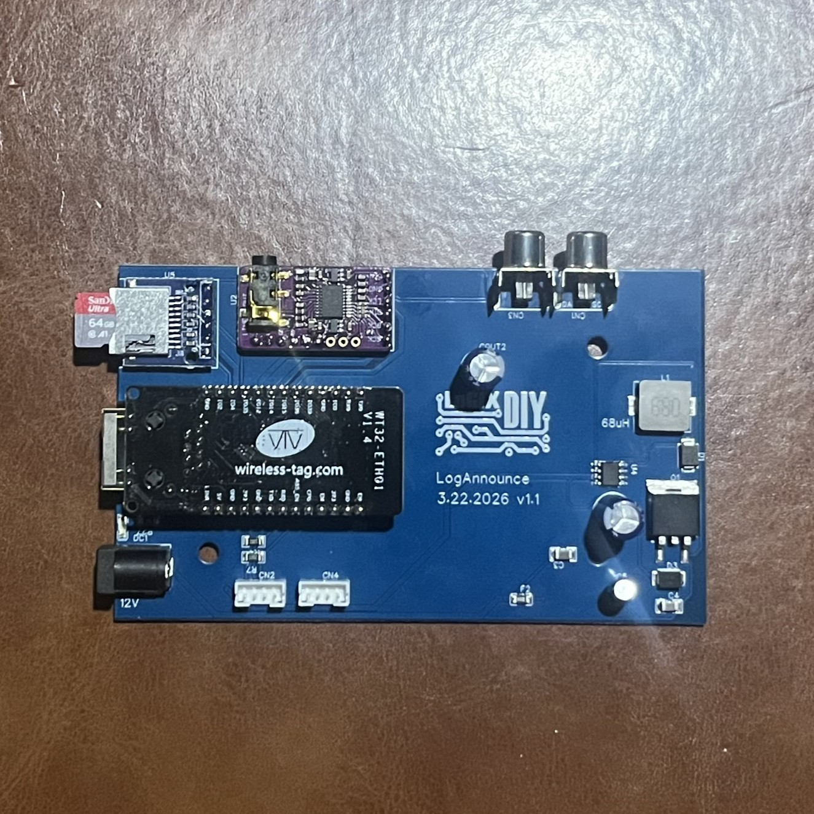
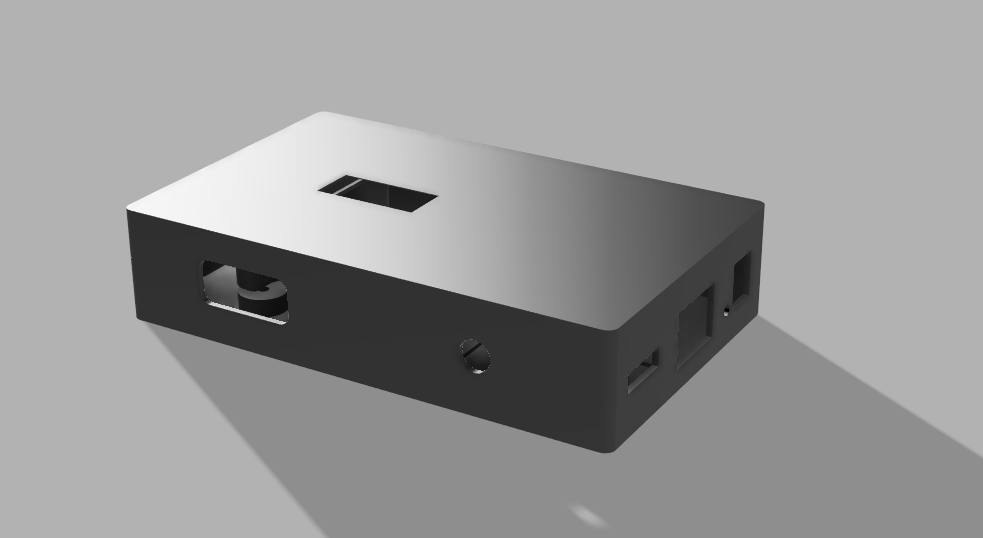
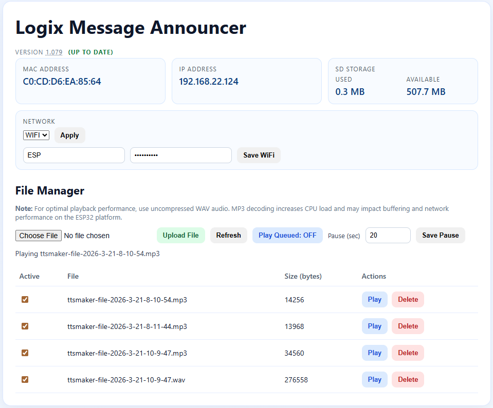

# Logix Message Announcer

Logix Message Announcer is an ESP32-based network audio playback appliance built around the WT32-ETH01 platform. It serves a browser-based control panel for managing audio files on SD storage, switching between Ethernet and Wi-Fi networking, controlling playback, and updating firmware.

## Overview

This project combines:

- WT32-ETH01 Ethernet-enabled ESP32 hardware
- SD card audio file storage
- Browser-based file and playback control
- OLED status display for IP address and playback state
- Ethernet or Wi-Fi network operation
- Versioned firmware releases with `.bin` artifacts
- OTA firmware updates from the web UI

## Device



## Enclosure

The device enclosure is a two-piece 3D-printed case designed to hold the announcer hardware as a finished unit. The top lid is modeled to fit the display opening, and the bottom section forms the main body of the case.



3D model files:

- [Case base](docs/models/la-case-base.3mf)
- [Case lid with LCD opening](docs/models/la-case-lid-lcd.3mf)

## Web UI



## Features

- Upload and manage `.mp3`, `.wav`, `.m3u`, and `.m3u8` files from the web UI
- Queue files and playlists for playback
- Show MAC address, IP address, SD usage, and queue state in the browser
- Switch between Ethernet and Wi-Fi modes from the UI
- Save Wi-Fi credentials on the device
- Show firmware version status against the GitHub repo
- Download or OTA-update firmware directly from the version control area of the web UI
- Export versioned firmware binaries into the `releases/` folder during PlatformIO builds

## Hardware Stack

- WT32-ETH01 ESP32 module
- LAN8720 Ethernet PHY
- SD card storage
- I2S audio output stage
- OLED I2C status display

## Project Layout

- `src/` firmware source
- `include/` board pins and build version header
- `scripts/` versioning helpers for pre/post build
- `docs/` API and project assets
- `releases/` versioned firmware `.bin` files

## Building

This firmware is built with PlatformIO.

```bash
platformio run
```

Upload to the configured device:

```bash
platformio run --target upload
```

Open the serial monitor:

```bash
platformio device monitor
```

## Versioning And Releases

- `include/build_version.h` contains the current firmware version compiled into the device
- `version.txt` stores the next build version
- successful builds export a versioned binary into `releases/`
- git tags such as `v1.079` are used for published firmware releases

## Web UI Firmware Updates

Clicking the version number in the web UI opens the firmware update dialog. From there you can:

- update directly to the newest tagged GitHub release binary
- upload a local `.bin` firmware file manually

## API

The device exposes an HTTP API for playback control, file management, networking, version reporting, and OTA firmware updates.

Base URL:

```text
http://<device-ip>
```

Full API spec:

- `docs/openapi.yaml`

### System Endpoints

- `GET /` web UI
- `GET /status` current playback and queue state
- `GET /version` current firmware build version
- `GET /network` active network status, IP, and MAC
- `POST /network/mode` switch between `eth` and `wifi`
- `GET /network/wifi` read saved Wi-Fi credentials
- `POST /network/wifi` save Wi-Fi credentials
- `POST /firmware/update` OTA firmware upload from a `.bin` file

### Playback Endpoints

- `POST /play` play a file from SD storage
- `POST /stop` stop playback
- `GET /volume` read current volume
- `POST /volume` set volume from `0` to `100`

### File Endpoints

- `GET /files` list playable files and playlists on the SD card
- `POST /files/upload` upload `.mp3`, `.wav`, `.m3u`, or `.m3u8`
- `DELETE /files?name=<filename>` delete a file from SD storage

### Playlist Endpoints

- `POST /playlist/item` enable or disable a file in the queue list
- `POST /playlist/queue` turn queued playback on or off
- `POST /playlist/start` start queued playback
- `GET /playlist/pause` read queue pause seconds
- `POST /playlist/pause` set queue pause seconds

### Example Requests

Get device status:

```bash
curl http://<device-ip>/status
```

Switch to Ethernet:

```bash
curl -X POST http://<device-ip>/network/mode \
	-H "Content-Type: application/json" \
	-d '{"mode":"eth"}'
```

Play a file:

```bash
curl -X POST http://<device-ip>/play \
	-H "Content-Type: application/json" \
	-d '{"file":"announcement.wav"}'
```

Set volume:

```bash
curl -X POST http://<device-ip>/volume \
	-H "Content-Type: application/json" \
	-d '{"volume":75}'
```

Upload audio:

```bash
curl -X POST http://<device-ip>/files/upload \
	-F "file=@announcement.wav"
```

## Notes

- For best playback performance, use uncompressed WAV files when possible
- The repo version indicator in the web UI depends on browser access to GitHub
- OTA updates require the device to remain reachable over the network for the duration of the upload